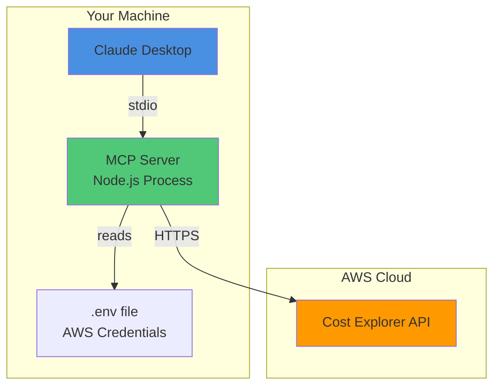
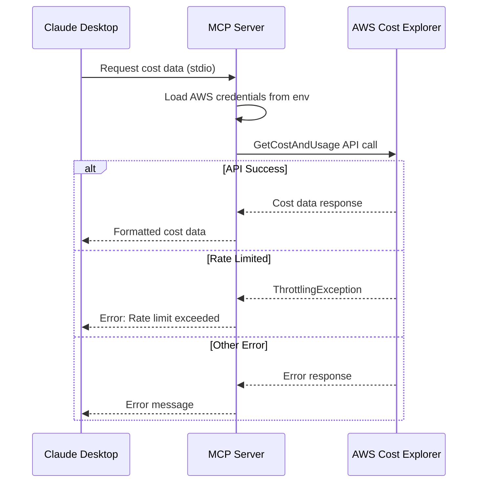
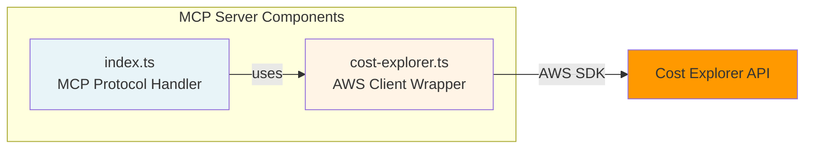

# AWS Cost Explorer MCP Server

A Model Context Protocol (MCP) server that provides AWS Cost Explorer API access to Claude Desktop. Query your AWS costs and usage data directly from Claude conversations.

## Architecture

### Local MCP Server (Current Implementation)



### Component Flow



### System Architecture



## Features

- **Simple Cost Queries**: Get cost and usage data for any time period
- **Flexible Grouping**: Group costs by Service, Usage Type, Region, Account, etc.
- **Multiple Metrics**: BlendedCost, UnblendedCost, AmortizedCost, and more
- **Rate Limit Handling**: Respects AWS API constraints with proper error handling
- **Secure**: Credentials stay local, no hardcoded secrets

## Prerequisites

- Node.js 18+
- AWS Account with Cost Explorer enabled
- AWS IAM credentials with `ce:GetCostAndUsage` permission
- Claude Desktop application

## Installation

1. **Clone the repository**
   ```bash
   git clone <repository-url>
   cd aws-mcp-cost-explorer
   ```

2. **Install dependencies**
   ```bash
   npm install
   ```

3. **Configure environment variables**
   ```bash
   cp .env.example .env
   ```

   Edit `.env` and configure for your authentication method:

   **Option A: AWS SSO (Recommended)**
   ```env
   AWS_REGION=us-west-2
   AWS_PROFILE=your-sso-profile-name
   ```

   Then login via SSO:
   ```bash
   aws sso login --profile your-sso-profile-name
   ```

   **Option B: IAM Credentials**
   ```env
   AWS_ACCESS_KEY_ID=your_access_key_here
   AWS_SECRET_ACCESS_KEY=your_secret_key_here
   AWS_REGION=us-east-1
   ```

4. **Build the project**
   ```bash
   npm run build
   ```

## Configuration

### Claude Desktop Setup

Add this configuration to your Claude Desktop config file:

**macOS**: `~/Library/Application Support/Claude/claude_desktop_config.json`

**Windows**: `%APPDATA%\Claude\claude_desktop_config.json`

**Option A: AWS SSO (Recommended)**
```json
{
  "mcpServers": {
    "aws-cost-explorer": {
      "command": "node",
      "args": ["/absolute/path/to/aws-mcp-cost-explorer/build/index.js"],
      "env": {
        "AWS_REGION": "us-west-2",
        "AWS_PROFILE": "your-sso-profile-name"
      }
    }
  }
}
```

**Option B: IAM Credentials**
```json
{
  "mcpServers": {
    "aws-cost-explorer": {
      "command": "node",
      "args": ["/absolute/path/to/aws-mcp-cost-explorer/build/index.js"],
      "env": {
        "AWS_ACCESS_KEY_ID": "your_access_key",
        "AWS_SECRET_ACCESS_KEY": "your_secret_key",
        "AWS_REGION": "us-east-1"
      }
    }
  }
}
```

**Option C: Use default AWS credentials**
```json
{
  "mcpServers": {
    "aws-cost-explorer": {
      "command": "node",
      "args": ["/absolute/path/to/aws-mcp-cost-explorer/build/index.js"]
    }
  }
}
```
This uses credentials from `~/.aws/credentials` or environment variables automatically.

### Required IAM Permissions

Your AWS IAM user/role needs these permissions:

```json
{
  "Version": "2012-10-17",
  "Statement": [
    {
      "Effect": "Allow",
      "Action": [
        "ce:GetCostAndUsage"
      ],
      "Resource": "*"
    }
  ]
}
```

## Available Tools

### `get_cost_and_usage`

Query AWS Cost Explorer for cost and usage data.

**Parameters:**
- `startDate` (required): Start date in YYYY-MM-DD format
- `endDate` (required): End date in YYYY-MM-DD format
- `granularity` (optional): DAILY, MONTHLY, or HOURLY (default: DAILY)
- `metrics` (optional): Array of metrics to retrieve (default: BlendedCost, UnblendedCost)
  - Available: `BlendedCost`, `UnblendedCost`, `AmortizedCost`, `NetAmortizedCost`, `UsageQuantity`, `NormalizedUsageAmount`
- `groupBy` (optional): Array of dimensions to group by
  - Example: `[{"type": "DIMENSION", "key": "SERVICE"}]`
  - Common dimensions: `SERVICE`, `USAGE_TYPE`, `REGION`, `LINKED_ACCOUNT`, `INSTANCE_TYPE`

**Example Queries in Claude:**

```
"What were my AWS costs last month?"

"Show me daily costs for the last 7 days grouped by service"

"Get my AWS costs from 2024-01-01 to 2024-01-31 by service"
```

## AWS API Limits & Constraints

**Important Rate Limits:**
- Cost Explorer API has a rate limit of approximately 1-2 requests per second
- Exceeded limits result in `ThrottlingException` errors
- The server handles throttling gracefully with error messages

**Best Practices:**
- Avoid rapid successive queries
- Use appropriate granularity (MONTHLY for long periods)
- Limit groupBy dimensions to reduce response size
- Cost data typically has 24-48 hour delay

**Cost Explorer Pricing:**
- API calls are not free
- First query per month: free
- Additional queries: $0.01 per request
- Check AWS pricing for current rates

## Development

**Build the project:**
```bash
npm run build
```

**Watch mode for development:**
```bash
npm run dev
```

**Run the server:**
```bash
npm start
```

## Security Notes

- ✅ No secrets hardcoded in source code
- ✅ `.env` file is gitignored
- ✅ `.env.example` provided as template
- ✅ AWS credentials stay on local machine
- ⚠️ Ensure your `.env` file has proper permissions (chmod 600)
- ⚠️ Never commit AWS credentials to git

## Troubleshooting

**Server not appearing in Claude Desktop:**
- Check config file path is correct
- Verify absolute path to `build/index.js`
- Restart Claude Desktop after config changes
- Check Claude Desktop logs for errors

**AWS Authentication Errors:**
- Verify credentials in `.env` file
- Check IAM permissions include `ce:GetCostAndUsage`
- Ensure AWS Cost Explorer is enabled in your account

**Rate Limit Errors:**
- Wait a few seconds between queries
- Cost Explorer has low rate limits by design
- Consider caching results for repeated queries

## Future Enhancements

### Remote Deployment (Planned)
Future versions may support remote deployment with SSE transport for:
- Team-wide access
- Centralized credential management
- Higher availability

This would require:
- HTTP server with SSE endpoints
- Authentication/authorization layer
- Secure credential storage (AWS Secrets Manager, etc.)
- HTTPS/TLS configuration

## License

MIT

## Contributing

Contributions welcome! Please ensure:
- No secrets in commits
- Follow existing code style
- Update README for new features
- Test with Claude Desktop before submitting